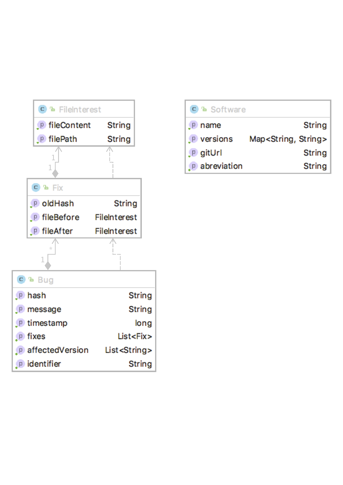

# Dataset Package

## What is it?

The bug collector package collect real bug fixes from apache commons projects by linking bug ids present in the commit message of the project to information available on the bug tracker. Information contains in the dataset are the following:

- hash
- timestamp
- message
- identifier
- affected versions
- fixes (files in their states before and after fix)
    
## Why? 

In the context of the TUNA project, and more specifically the paper "On the Impact of Tokenizer and Parameters on N-Gram Based Code Analysis" published at ICSME'18 a dataset of real defects was required to evaluate whether the use of different tokenizer were capable of troubling the outcome of research based on naturalness. This leads to the creation of this dataset generator tool that is close to the vulnerability one available at this link : [data7](https://github.com/electricalwind/data7) at it share most of its code.

## Requirements

There is no requirement for this tool, as maven will take care of all dependencies.

## How does it work ?

For a given project P supported by the tool:

1. clone or pull P in the chosen folder
2. analyse all commits in the history of the project, check for a mention to a bug id, if found keep the commit and the bug id
3. For each selected commit, check on the bug tracker whether the bug id corresponds to a real bug, if yes retrieve all information on the bug. 


## Dataset Structure
          
The dataset generated by the tool is only available through its binary serialized form and can be accessed through the following api:


When calling upon the creation of the dataset for a project P, a list of Bug will be returned. A bug object here corresponds to a commit that was declared as a Bug fix and contains the following information, the hash, message and timestamp of the commit, the bug id as well as the version of the project that was affected by it and a list of all the file that were fixed (Fix Object). A fix Object contains the information on the file before and after it was fixed as well as the hash of the last commit that modified it before the fix.


## Supported projects

So far, only projects from the apache commons are supported as the rest interface from apache jira is used to check for the bug id.

* Bcel
*  BeansUtils
*  Cli
*  Collections
*  Configuration
*  Compress
*  CSV
*  DBUtils
*  EMail
*  FileUpload
*  Io
*  JCS
*  Jexl
*  Lang
*  Math
*  Net
*  Pool
*  Rng
*  Text
*  Vfs

Note that the tool can be extended to additional projects, but those need to be present on this bug tracker [jira](https://issues.apache.org/jira/secure/Dashboard.jspa)
and the information of the Software class made available:

````java
/**
 * Software
 * A class gathering the required intel on a software project to create the dataset
 * it contains:
 *  the name of the software
 *  the abbreviation used for issues
 *  the URL of the git remote repository
 *  and A list of all versions of the software and their corresponding commit
 */
public class Software implements Serializable {
    private final String name;
    private final String abbreviation;
    private final String gitUrl;
    private final Map<String, String> versions;

    public Software(String name, String abbreviation, String gitUrl, Map<String, String> versions) {
        this.name = name;
        this.abreviation = abbreviation;
        this.gitUrl = gitUrl;
        this.versions = versions;
    }
}
````

## How to use the tools

To build a dataset, simply chose a project from the Softwares factory or all of them,
Then create a BugDatasetGenerator by giving it a software object and a location where the project is supposed to be cloned or pull if already done.
Once the object created, the method retrieveBugs can be called, this method will return a list of bugs that can be saved using the method save bugs.
```java 

 for (Software software : Softwares.getAll()) {
            BugDatasetGenerator bugDatasetGenerator = new BugDatasetGenerator(software, "myPath"+software.getAbreviation()+"/");
            try {
                List<Bug> bugs = bugDatasetGenerator.retrieveBugs();
                System.out.println("For " + software.getName() + ": " + bugs.size() + " found");
                BugDatasetGenerator.saveBugs(bugs,"myPathToSave"+software.getAbreviation()+"-bugs.obj");
            } catch (GitAPIException | IOException e) {
                e.printStackTrace();
            }

        }

``` 
    
Note that the tool provides, other utilities present in the utils class that allows to reorder the bug by version they affected, or around the buggy files.

## Statistics

By the end of 2017, the dataset had the following:

|Project                 | Latest       | Files     | kLoC     | Versions | Bugs |
|:---------------------------:|:------------:|:---------:|:-----:|:--------:|:----:|
|BCEL                         | 6.1          | 488       | 75       | 5        | 93   |
|BeansUtils                   | 1.9.3        | 257       | 72       | 18       | 155  |
|CLI                          | 1.4          | 50       | 12   | 6        | 91   |
|Collections                  | 4.1          | 525       | 118   | 12       | 186  |
|Compress                     | 1.15         | 329       | 70       | 18       | 309  |
|Configuration                | 2.2          | 457       | 125   | 15       | 325  |
|CSV                          | 1.4          | 28        | 8.4      | 5        | 67   |
|DBUtils                      | 1.7          | 92        | 15   | 8        | 23   |
|EMail                        | 1.4          | 47        | 12    | 8        | 51   |
|FileUpload                   | 1.3.3        | 54        | 10   | 10       | 67   |
|IO                           | 2.5          | 227       | 55       | 14       | 213  |
|JCS                          | 2.2.1        | 562       | 102   | 6        | 102  |
|Jexl                         | 3.1          | 108       | 23       | 8        | 126  |
|Lang                         | 3.6          | 318       | 141   | 20       | 567  |
|Math                         | 3.6.1        | 970       | 218   | 16       | 830  |
|Net                          | 3.6          | 270       | 59       | 20       | 246  |
|Pool                         | 2.4.2        | 79        | 24       | 22       | 154  |
|Rng                          | 1.0          | 124       | 14   | 1        | 3    |
|Text                         | 1.1          | 104       | 25       | 2        | 38   |
|VFS                          | 2.2          | 382       | 52    | 4        | 214  |
|Total                  | -         | 5,471    | 1,230 | 218     | 3860 |

## Third Party

JGIT (Eclipse)
Unirest (MIT)
